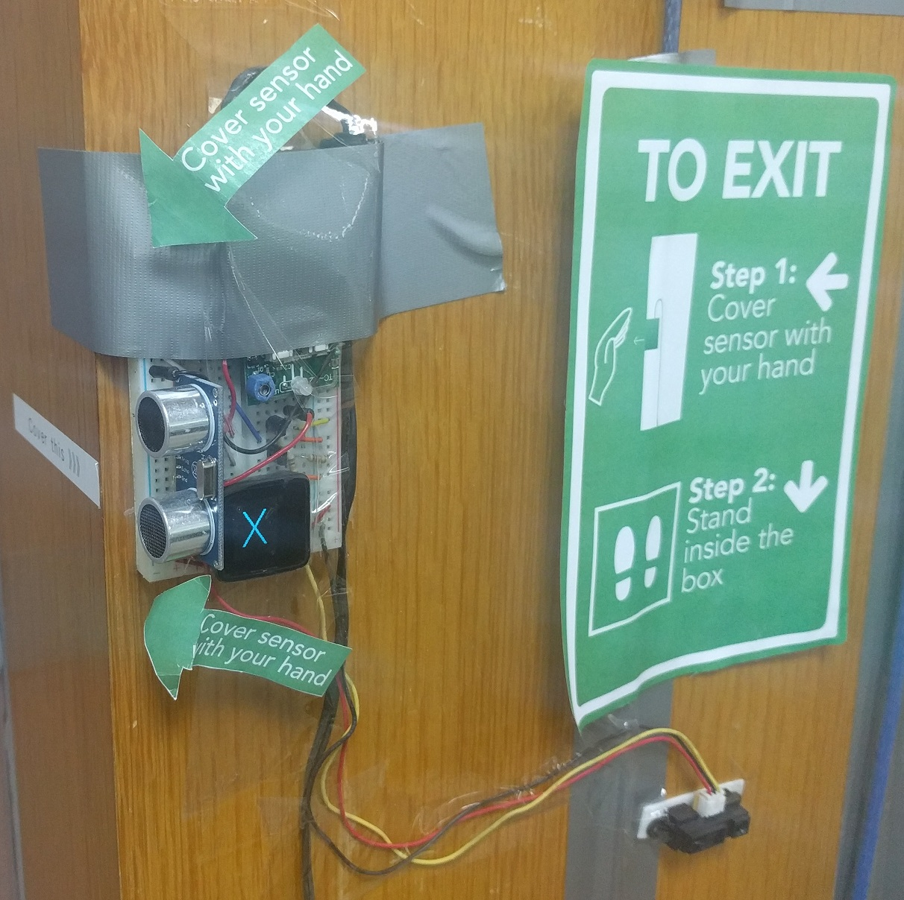
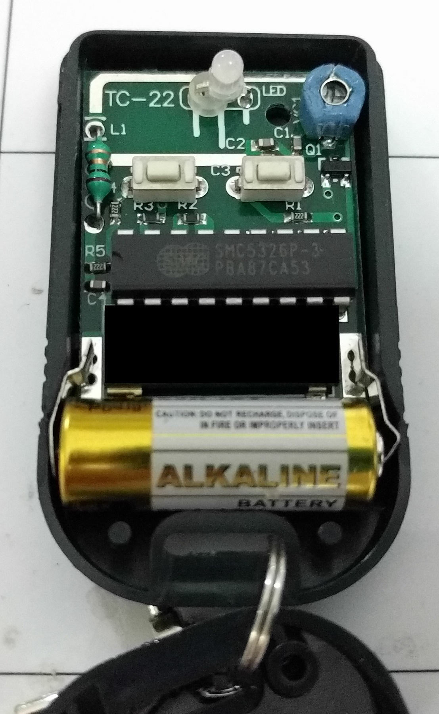

# Auto Door Unlocker

A device at the exit that unlocks the main office door of the Singapore Power Digital Team's office at Keppel Tower 2 with just a hand gesture. There are several iterations

1. Passive Infrared (PIR) sensor
2. Active IR sensor
3. Active IR and Ultrasonic sensor

## Demo media

## How it works?

This device leverages on the original wireless remote to do the unlocking as seen in the picture below.

To detect the hand gesture, an active Infrared Sensor is used to detect changes in the environment infrared signature.

The IR sensor sends an analog signal to the Microview microcontroller indicating the distance of the object in front of it. If the threshold is hit, the Microview then simulates a button press by applying a voltage on the button circuit on the remote to send the wireless signal to unlock the doors. An animation is also shown on the OLED screen of the Microview.

A 2 seconds delay is imposed on the initial power on of the device to let the sensors "settle" down

## Schematic

A Fritzing drawing indicates the connections on the breadboard. Note this is just a guide of connection and not representative of the actual physical layout.

The button circuit on the remote requires a 12V input to engage. I had to use 2 transistors to switch the input as the output pin on both the Microview and PIR sensor do not seem to be able to saturate the transistor. Engaging the button requires an opposite signal, output LOW to "press" the button and vice-versa.

## Parts required
1. MV1: [Microview module](https://www.sparkfun.com/products/12923)
2. J3: [Sharp GP2Y0A21YK IR sensor 10-80cm](http://www.sgbotic.com/index.php?dispatch=products.view&product_id=20)
3. hc-sr1: [HC-SR04 v2](http://www.sgbotic.com/index.php?dispatch=products.view&product_id=1855)
3. R1 and R2: 10K ohm resistors
4. U1 and U2: [P2N2222A NPN transistor](http://www.sgbotic.com/index.php?dispatch=products.view&product_id=773)
5. J2: [2.1mm DC barrel jack](https://www.adafruit.com/product/373)

## Setting up the IDE for compilation

1. Programming the Microview requires one-time use of the [Microview USB Programmer](https://www.sparkfun.com/products/12924)
2. You can follow the Arduino set up guide in this [link](http://microview.io/intro/getting-started.html) which is summarised in the subsequent steps I recommend the native Arduino IDE instead of Codebender.
3. Download the latest [Arduino IDE](https://www.arduino.cc/en/Main/Software) which is version 1.6.13 at time of writing.
4. `git clone https://github.com/geekammo/MicroView-Arduino-Library.git` to your Arduino library folder which is `~/Documents/Arduino/libraries` directory on Macs.
5. Open the `auto-door-unlocker-code` file with the Arduino IDE and select Arduino/Genuino Uno as the board type. Make sure to choose the correct serial port associated with the USB programmer.
6. Just hit upload button to program the board.

## References and libraries

1. [Control 12V from 5V signal](https://electronics.stackexchange.com/a/70246)
2. [Hand image](https://pixabay.com/p-297767/)
3. [Sharp IR library](https://github.com/guillaume-rico/SharpIR)
4. [Ultrasonic HC-SR04](http://randomnerdtutorials.com/complete-guide-for-ultrasonic-sensor-hc-sr04/)
